# Getting Started with NetBeans on Windows
NetBeans is an open-source IDE written in Java and supported by Oracle. 
It is similar to Eclipse, but has better suggestion and tool support for PHP development.

## NetBeans IDE Setup

### Downloading
NetBeans should be downloaded from [http://www.oracle.com/technetwork/articles/javase/jdk-netbeans-jsp-142931.html](http://www.oracle.com/technetwork/articles/javase/jdk-netbeans-jsp-142931.html), which links to the JDK from Oracle with NetBeans Bundled.
The download from netbeans.org does not install properly, and requires users to run NetBeans as an administrator enter an administrator password every time NetBeans is opened.

**Note:** installing NetBeans requires administrator privileges.

### Configuring

The NetBeans bundled with the JDK only comes with Java support out of the box, so PHP support must be added manually.
In the menu bar, click `Tools -> Plugins`.
In the *Available Plugins* tab, search for *PHP* and install the following plugins:
- PHP
- PHPUnit
- PHP Enhancements (Optional)
- PHP Static Analysis (Optional)

After restarting NetBeans, you will be able to create and open PHP projects.

### Checking Out a Project

#### Step 1: Subversion Repository

In the top menu, click `Team -> Subversion -> Checkout`.

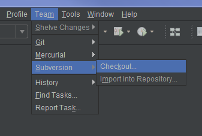

In the dialogue that appears, fill in *Repository URL* with the URL to the correct subversion repository:

| Site        | Repository URL                                             |
|-------------|------------------------------------------------------------|
| Climate     | http://subversion.cmc.ec.gc.ca/repos/climate               |
| Water       | http://subversion.cmc.ec.gc.ca/repos/water                 |

Fill in *User* and *Password*, with your personal SVN credentials.
If you have already added them to the B3 server profiles, you can run the command `aliases` which will list them. 
Otherwise contact your supervisor for that information.

Check the *Save Username and Password* check box and then click *Next >*.

#### Step 2: Folders to Checkout

In the current window click on the *Browse...* button after *Repository Folder(s):* and select the working branch from the *Branches* directory. 
By default NetBeans stores projects in ~/Documents/NetBeans Projects, but you can change that if you want.
**Make sure you remember where the directory of project, you will need it later.**
Make sure the *Scan for NetBeans Projects after Checkout* box is checked.
Pressing *Finish* will start downloading the project. 
This could take a few minutes depending on the site.

### Setting up a Checked Out PHP Project

When the project has been successfully checked out, the following window will appear, click *Create Project...*.

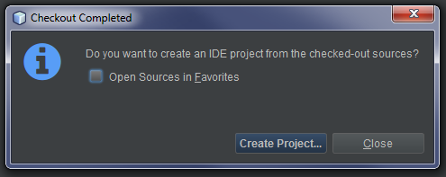

#### Step 1: Choose Project

In the initial window, select `PHP -> PHP Application from Remote Server` and then click *Next >*.

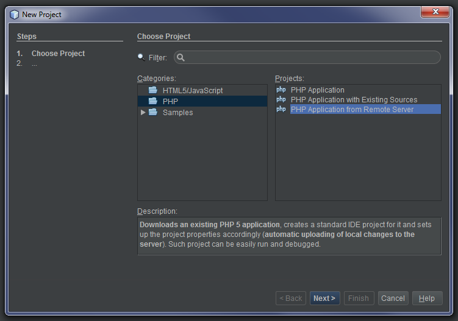

#### Step 2: Name and Location

Fill out the *Name and Location* window with the following information:

| Field           | Content                                                |
| --------------- | -------------------------------------------------------|
| Project Name    | This is what appears in the NetBeans sidebar, can be anything you want, ex. *Water - Release 24* |
| Sources Folder  | You must change this to wherever you checked out the project to, by default it's in `~/Documents/NetBeans Projects/`. The notice: *Project Sources directory is not empty* should appear at the bottom of the window since the directory contains the checked out site. | 
| PHP Version     |  Used for PHP code hints, the Climate and Water sites use PHP v5.5 |
| Default Encoding | Set this to UTF-8 (default)                           |

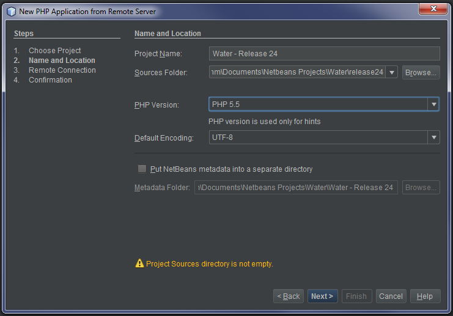

Then click *Next >*.

#### Step 3: Remote Connection

The remote connection dialogue sets up a remote connection to the deployment server. 
When changes are made locally, those changes will automatically be uploaded to the specified server. 

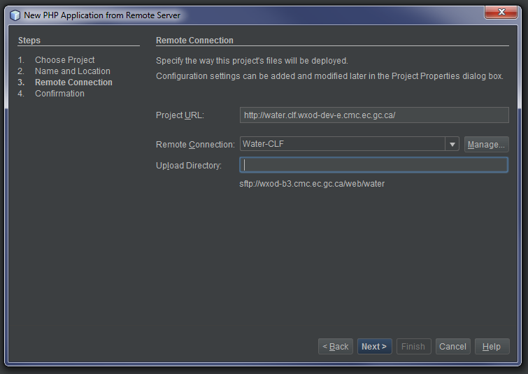 

If it is your first time adding a project, you must also set up a remote connection. 
Click the *Manage...* button to open the *Manage Remote Connections* window.
In the *Manage Remote Connections* window, click *Add...* to create a new remote connection. 
Provide a name and set the connection type to *STP *.

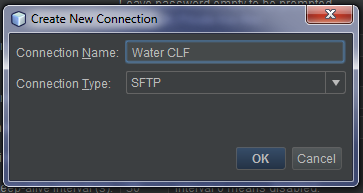

After clicking *OK*, fill out the remote connection info with the following:

| Field               | Climate CLF          | Water CLF            | Climate Dev          | Water Dev             | 
| -----------------   | ------------------   | -------------------- | -------------------- | --------------------- |
| Host Name           | wxod-b3.cmc.ec.gc.ca | wxod-b3.cmc.ec.gc.ca | wxod-b5.cmc.ec.gc.ca | wxod-b3.cmc.ec.gc.ca  |
| Port                | 22 (default)         | 22 (default)         | 22 (default)         | 22 (default)          |
| User Name           | asptcli              | asptwater            | asptcli              | asptwater             |
| Private Key File    | (optional)           | (optional)           | (optional)           | (optional)            |
| Known Hosts File\*   | (optional)           | (optional)           | (optional)           | (optional)            |
| Initial Directory   | /web/climate         | /web/water           | /web/climate         | /web/water            |
| Timeout             | 30 (default)         | 30 (default)         | 30 (default)         | 30 (default)          | 
| Keep-alive interval | 30 (default)         | 30 (default)         | 30 (default)         | 30 (default)          | 

\*A *Known Hosts File* is not mandatory, but not having it set will cause a SSH verification window to appear every time a new connection is made.
A known hosts file is just a simple text document that stores RSA fingerprints of servers.
Just make an empty text document on your computer and open it by clicking on *Browse...* beside the *Known Hosts File* field.

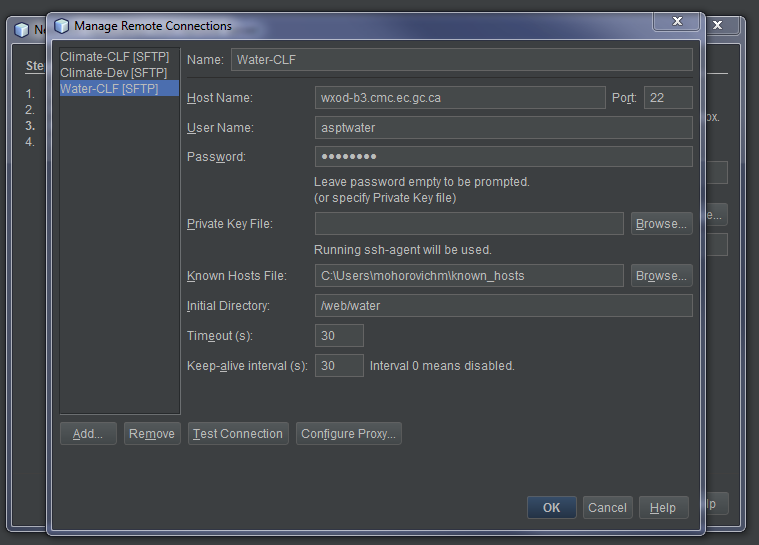

After filling out an initial connection, click on the *Test Connection* button to test your newly created connection.

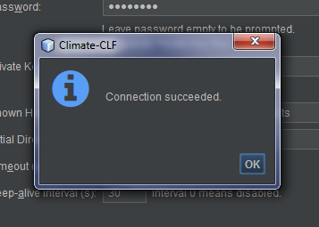

After clicking *OK* and returning to the remote connection window, fill out the Project URL with the appropriate URL from the table below.
The Upload Directory should be left blank if the *Initial Directory* was set using the information from the table above.

| Site           | URL                                                   |
| -------------- | ------------------------------------------------------|
| Climate - CLF  | http://water.clf.wxod-dev-e.cmc.ec.gc.ca/             |
| Water - CLF    | http://water.clf.wxod-dev-e.cmc.ec.gc.ca/             |
| Climate - DEV  | http://climate.wxod-dev-e.cmc.ec.gc.ca/               |
| Water - DEV    | http://water.wxod-dev-e.cmc.ec.gc.ca/                 |
| Climate - Stage  | http://climate.wxod-dev-e.cmc.ec.gc.ca/               |
| Water - Stage    | http://water.wxod-dev-e.cmc.ec.gc.ca/                 |

Click *Next >*.

#### Step 4: Confirmation

The last step is confirming you have set up your remote connection properly. 
If the window looks similar to the one below, then you should be good to go.

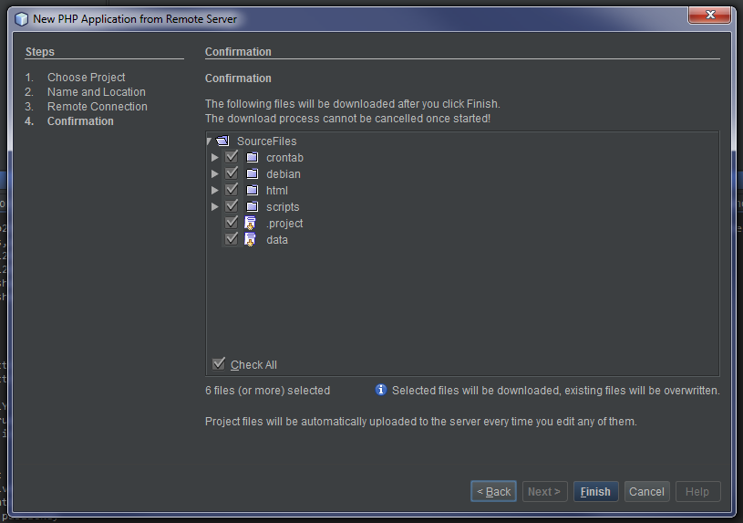

Make sure to uncheck *Check All*, and check only one arbitrary file.
NetBeans makes it mandatory to download something, and you shouldn't download everything because that would include the working files of other teamates.
After clicking *Finish*, the download will start and finish, and the project should be ready to work with.

### Additional Project Configuration

Some project may need extra configuration such as sass compilation debugging or unit testing. 

#### Sass Compilation

NetBeans has built in support for automatic sass compilation. 
This requires Ruby and the Sass gem to be installed.
Ruby can be installed from [here](http://rubyinstaller.org/downloads/), and once Ruby is installed, simply run the command `gem install sass` from command prompt. 

**Note:** If the gem command is not found, restart command prompt and try again. If it still doesn't work try restarting your computer.

After Ruby and Sass are installed, you must set the Sass executable location in NetBeans settings. 
Navigate to `Tools -> Options -> HTML/JS -> CSS Preprocessors` from the menubar, and click on the *Search...* button beside the *Sass Path* field.
If this does not work, you will have to manually find where your *sass.bat* file is located. 
It would be located in the bin directory in the directory you set in *RubyInstaller*.

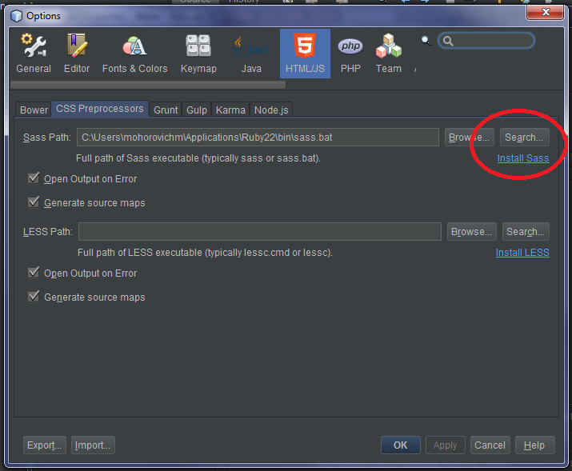

After installing setting up Ruby and Sass in NetBeans, open up a project's settings by right clicking on the Project name in the sidebar and select *Properties*.

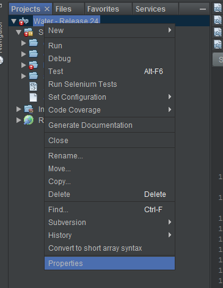

Navigate to *CSS Preprocessors* and check the *Compile Sass Files on Save* box.
Add as many input and output directories for scss and css files as necessary.
Adding the following compiler flags: `--sourcemap=none --style compressed`, will disable source map generation and have the outputted css be compressed.

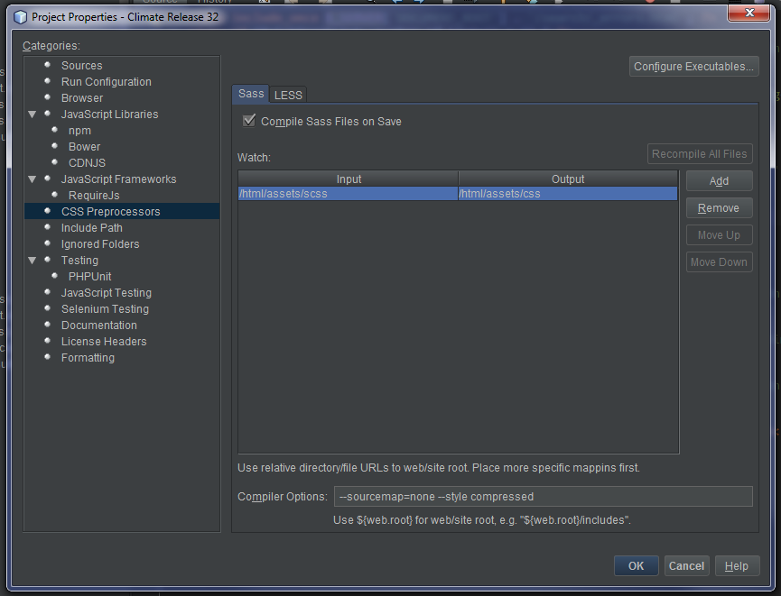

#### PHPUnit

PHPUnit is the de factor standard for unit testing in PHP. Setting up PHPUnit in NetBeans requires PHP to be installed, and the PHPUnit libraries.

##### Step 1: Downloading PHP

PHP for Windows can be installed from [http://windows.php.net/download/](http://windows.php.net/download/).
Currently, the projects are using PHP 5, so you should download the latest version of the Non Thread Save PHP 5. 

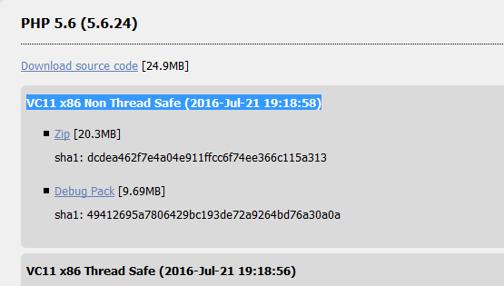

Download the Zip file and extract it anywhere you'd like, ex. `C:/PHP/`. 

##### Step 2: Configuring PHP in NetBeans

After unzipping the PHP download to a directory on your computer, in NetBeans navigate to `Tools -> Options -> PHP -> General`.
In the PHP General options, click on the *Browse...* button and open up the *php.exe* executable wherever you unzipped PHP to.

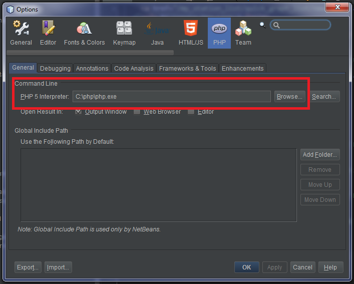

##### Step 3: Downloading PHPUnit

After PHP is installed, navigate to [https://phpunit.de/](https://phpunit.de/) and download the current stable release.

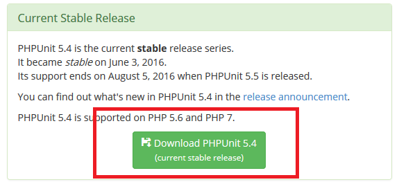

Download that and place it somewhere on your computer, example, in `C:/bin/`

##### Step 4: Configuring PHPUnit in NetBeans

After you've downloaded the phpunit\*.phar file, open up `Tools -> Options -> PHP -> Frameworks & Tools`.
In the options window, click on the *Browse...* button beside *PHPUnit Script*, and navigate and find that .phar file.

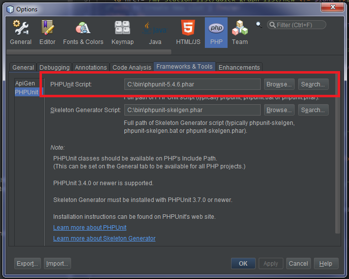

##### Step 5: Configuring PHPUnit for Projects

After PHPUnit is set up in NetBeans, there is a tiny bit of configuration necessary to use it in projects.
Open up a project's properties by right clicking on the Project name in the navigation pane.

In the project properties window, check the *Use Bootstrap* checkbox, and browse for the phpunit bootstrap script. 
The script name and location depends on the project, but may reside in the root of the project, or the root of the test directory.
Do the same for the *XML Configuration* (if necessary).

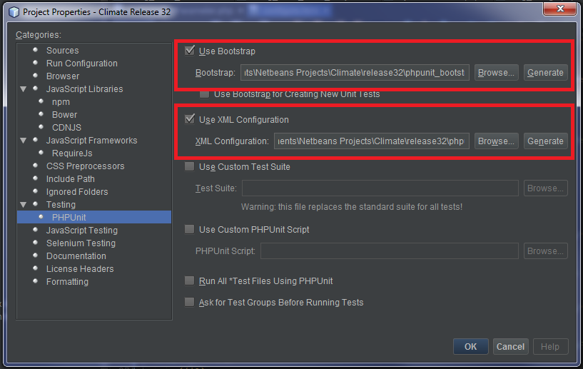

After the project phpunit configuration is done, you should be able to run all unit tests by right clicking on the project name, and clicking *test*.

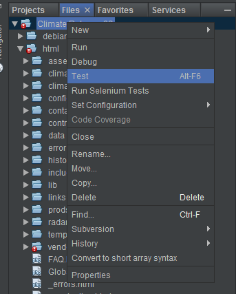

The results will appear in a new pane.

## Additional Optional Configuration

### Subversion Settings
By default NetBeans does not automatically lock files when you try to edit them.
It also does not show you when files are locked. 
You can change this by navigating to `Tools -> Options -> Team -> Versioning -> Subversion` from the menu bar, and changing the options highlighted in the screenshot below.

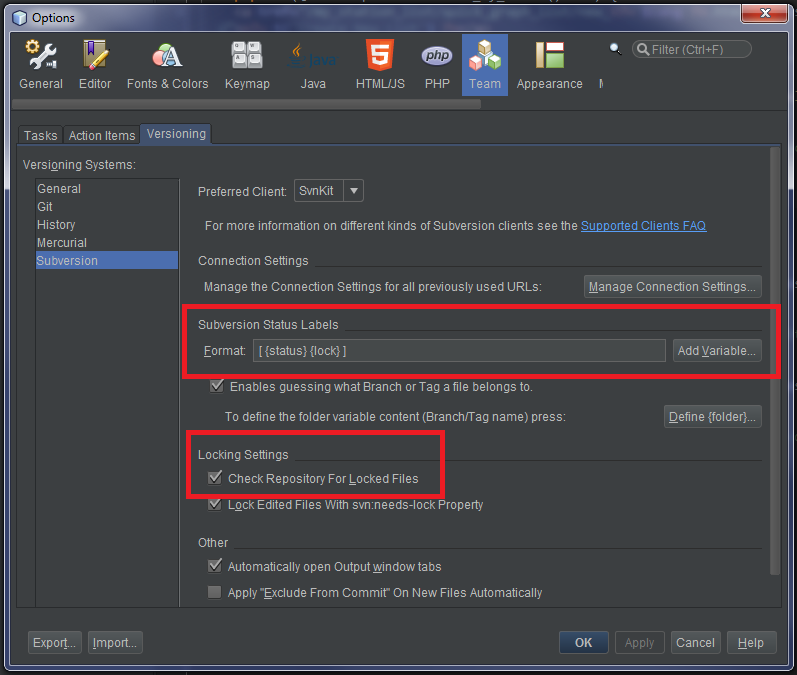

### Dark Look and Feel

The theme used in the screenshots use the NetBeans Darcula theme.
It can be installed from the Plugins manager: `Tools -> Plugins`, and clicking on the *Available Plugins* tab, and searching for *Darcula LAF for NetBeans*.

### Vim Keybindings

If you are used to Vi keybindings, there is the jVi plugin which adds them to NetBeans.
First, you must install the *jVi for NB-7.0 Update Center* plugin, which adds an additional plugin repository to NetBeans.
After installing that and restarting NetBeans, install the *jVi for NetBeans* plugin. 
If nothing shows up, click on the *Check for Newest* button and try searching for it again.

**Note:** Installing jVi overwrites your Editor settings: indentation, code formatting rules etc. 
You must set those manually in the jVi Config in NetBeans Options (`Tools -> Options`).

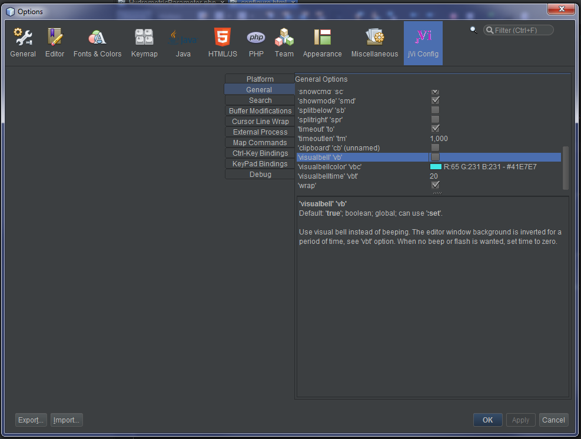